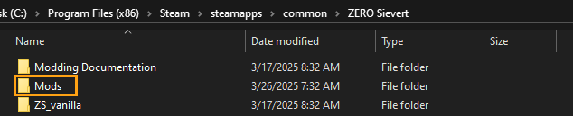
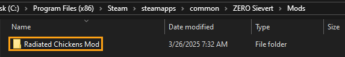
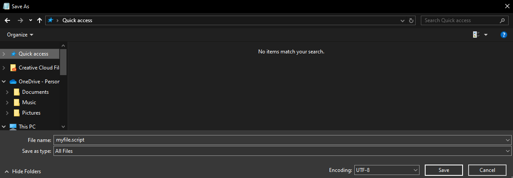
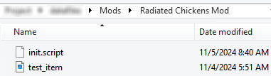
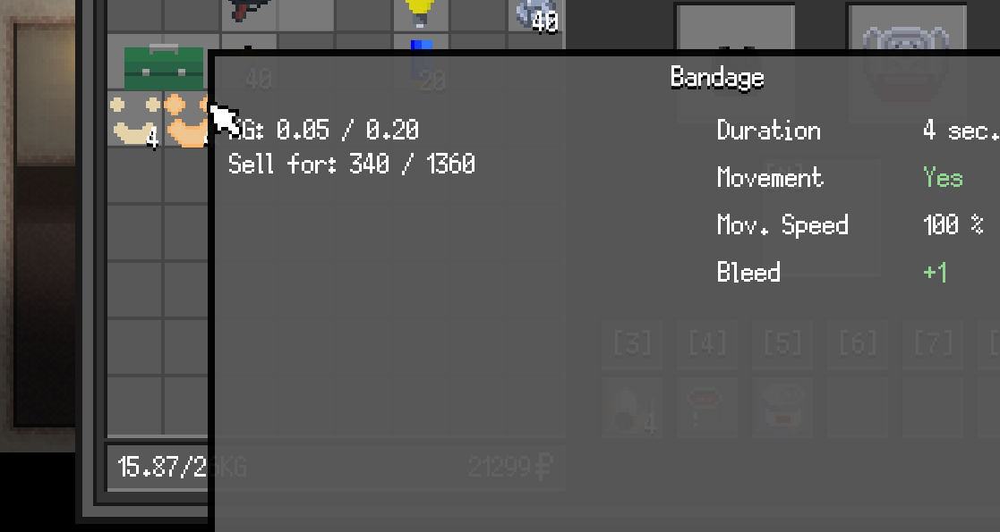

# Getting Started

First you will need to create (if you don't already have one) a "**_Mods_**" folder in the base directory of Zero Sievert.



Next, create a new folder in the “**_Mods_**” folder. Name it whatever you’d like your mod to be named. For our example, it’ll be named, “**_Radiated Chickens Mod_**”.



Next let’s create our first script, “**_init.script_**”, in our mod folder. There are event hooks that allow us to run code and the “**_init_**” hook is one of them. This event runs when the mod first loads which is a great time for us to load some data.

To create a "**_.script_**" file, it's as easy as modifying the file name. The fastest way to do this is to open a text file in notpad or any text editor your prefer, and use the "Save As" feature. This will let you type out the file name with the preferred extension.



Now open up the script in notepad, notepad++ or any other text editor of your choice. Now go ahead and add this code to your script file. This will load a sprite and assign it to any item we want. We’re going to replace the bandage item sprite, hence the “bandage” written as the second argument.

```lua
-- Load our item sprite
SpriteLoad("test_item.png","bandage",1,0,0,0);
```

Next, we’ll need to add this image (down below, the smiley face) to our mod folder, and name it “**_test_item.png_**”


If you’ve done everything correctly, up until this point, your mod folder should now look like this!!



Now if we run the game and head into the hub... Bandages should look like this now!

